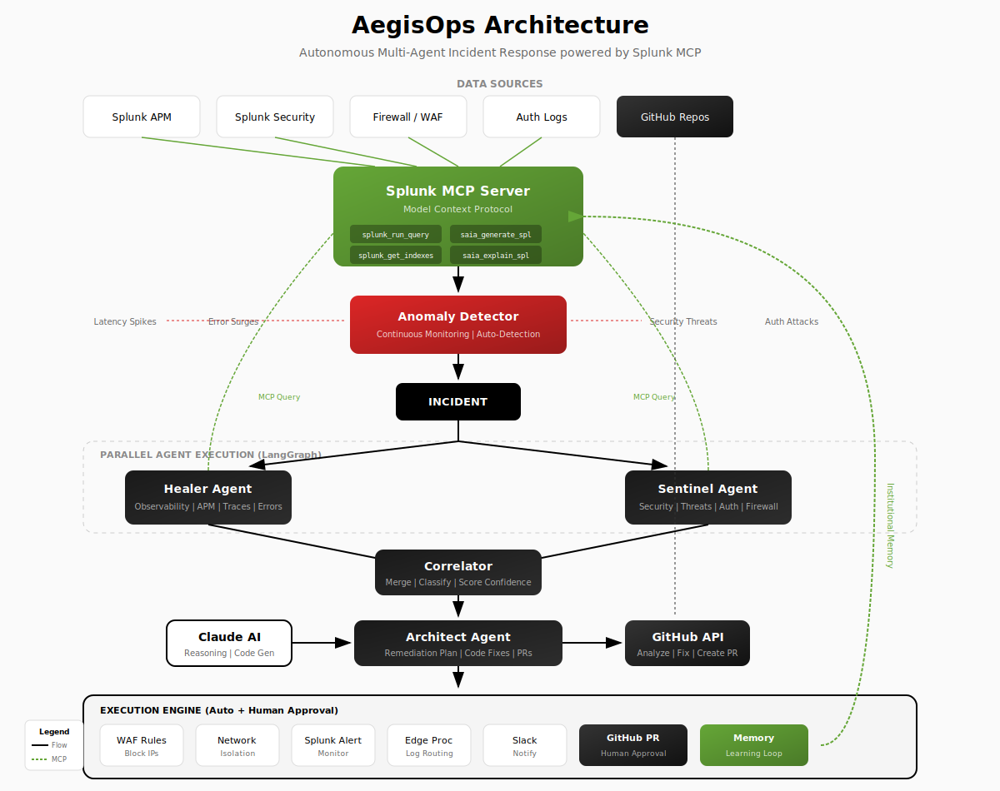

# AegisOps

**Autonomous Enterprise Reliability & Security Nexus**

A multi-agent AI platform that unifies Security, Observability, and Platform operations using Splunk's Model Context Protocol (MCP) Server.

Built for the [Splunk Agentic Ops Hackathon 2026](https://splunk.devpost.com).

## The Concept

Most AI operations platforms are siloed—they fix a bug, block an IP, or write a query. **AegisOps** combines all three using the Splunk MCP Server. By looking across Security, Observability, and Platform architecture simultaneously, our agentic platform doesn't just discover an outage—it uncovers if the outage is a cyberattack, neutralizes the threat, fixes the underlying code, and optimizes the resulting Splunk data stream.

## Architecture



```
                    ┌─────────────────┐
                    │  Incident In    │
                    └────────┬────────┘
                             │
              ┌──────────────┴──────────────┐
              │         PARALLEL            │
              ▼                             ▼
    ┌─────────────────┐           ┌─────────────────┐
    │  Healer Agent   │◄──────────┤  Splunk MCP     │
    │  (Observability)│           │  Server         │
    └────────┬────────┘           │                 │
             │                    │  • splunk_run_query
             │                    │  • saia_generate_spl
    ┌────────┴────────┐           │  • saia_explain_spl
    │ Sentinel Agent  │◄──────────┤  • splunk_get_indexes
    │   (Security)    │           └─────────────────┘
    └────────┬────────┘
             │
    ┌────────┴────────┐
    │   Correlator    │  ← Merges findings, determines severity
    └────────┬────────┘
             │
    ┌────────┴────────┐
    │   Architect     │  ← Generates remediation + code fixes
    └────────┬────────┘
             │
    ┌────────┴────────┐
    │ AUTO-EXECUTE    │  ← WAF rules, alerts, PRs (autonomous)
    └────────┬────────┘
             │
    ┌────────┴────────┐
    │  GitHub PR      │  ← Human approval for code merges
    └─────────────────┘
```

### Agent Roles

| Agent          | Domain        | Splunk AI Tools Used                                    |
| -------------- | ------------- | ------------------------------------------------------- |
| **Healer**     | Observability | `splunk_run_query` for APM traces, latency analysis     |
| **Sentinel**   | Security      | `splunk_get_indexes` for firewall/auth log discovery    |
| **Correlator** | Synthesis     | `saia_explain_spl` to understand query results          |
| **Architect**  | Platform/DX   | `saia_generate_spl` for AI-assisted remediation queries |

## Splunk AI Integration

AegisOps integrates with Splunk's AI capabilities via the MCP Server:

### Tools Used at Runtime

| Tool                 | Purpose                                                   | When Called                    |
| -------------------- | --------------------------------------------------------- | ------------------------------ |
| `splunk_run_query`   | Execute SPL queries against live Splunk data              | Healer/Sentinel analysis phase |
| `splunk_get_indexes` | Discover available indexes and sourcetypes                | Sentinel threat correlation    |
| `saia_generate_spl`  | **AI-powered** SPL query generation from natural language | Architect remediation planning |
| `saia_explain_spl`   | **AI-powered** SPL query explanation                      | Correlator findings synthesis  |

### Example Flow

1. **Incident**: "Payment API latency spike with suspicious IP bursts"
2. **Healer** calls `splunk_run_query` to fetch APM traces
3. **Sentinel** calls `splunk_get_indexes` to find firewall logs, then queries them
4. **Correlator** uses `saia_explain_spl` to summarize complex query results
5. **Architect** calls `saia_generate_spl` to create Edge Processor rules and alerts
6. **Execution**: WAF rules deployed, Splunk alerts created, GitHub PR opened

## Tech Stack

- **Backend**: Node.js, TypeScript, Express, Server-Sent Events
- **Agent Framework**: LangGraph JS (parallel agent execution)
- **LLM**: Anthropic Claude (code generation, reasoning)
- **Frontend**: React 18 + Vite + TailwindCSS (Liquid Glass UI)
- **Splunk Integration**: MCP Server (JSON-RPC 2.0)
- **GitHub Integration**: Octokit (automatic PR creation)

## Quick Start

### Prerequisites

- Node.js 20+
- npm 10+
- Anthropic API key

### Installation

```bash
# Clone the repository
git clone https://github.com/yourusername/aegis-ops.git
cd aegis-ops

# Install dependencies
npm install

# Copy environment variables
cp .env.example .env

# Add your Anthropic API key to .env
# ANTHROPIC_API_KEY=your-key-here

# Build all packages
npm run build

# Start development servers
npm run dev
```

### Access

- **Frontend**: http://localhost:5173
- **API**: http://localhost:3001

## Usage

1. Open the Mission Control dashboard at http://localhost:5173
2. Click "Load Demo" to populate a sample incident scenario
3. Click "Analyze Incident" to trigger the agent workflow
4. Watch the Agent Activity Stream as Healer and Sentinel analyze in parallel
5. System automatically executes remediation actions
6. If code fix is needed, a GitHub PR is created for human review

## Autonomous Workflow

AegisOps is **fully autonomous** by design:

- **Analysis**: Healer + Sentinel run in parallel
- **Correlation**: Findings merged, severity determined
- **Remediation**: Plan generated with blast radius prediction
- **Execution**: All actions run automatically (WAF rules, alerts, notifications)
- **Code Fixes**: PRs created automatically, human approval on GitHub

Human-in-the-loop is preserved for **code merges only** - the most critical decision.

## Project Structure

```
aegis-ops/
├── apps/
│   ├── api/          # Backend (Express + LangGraph)
│   │   └── src/
│   │       ├── agents/     # Healer, Sentinel, Correlator, Architect
│   │       ├── mcp/        # Splunk MCP providers (live + mock)
│   │       └── graph/      # LangGraph workflow
│   └── web/          # Frontend (React + Vite)
├── packages/
│   └── shared/       # Shared TypeScript types
├── docs/
│   └── architecture.svg  # Architecture diagram
└── package.json      # Monorepo root
```

## Connecting to Splunk

### Demo Mode (Default)

By default, AegisOps runs with `SPLUNK_MODE=mock`, using realistic simulated data.

### Live Splunk Connection

1. Install [Splunk MCP Server](https://help.splunk.com/en/splunk-cloud-platform/mcp-server-for-splunk-platform/) on your Splunk instance
2. Configure connection in the UI or via environment:

```bash
SPLUNK_MODE=live
SPLUNK_MCP_ENDPOINT=https://your-splunk:443/services/mcp
SPLUNK_TOKEN=your-bearer-token
```

## GitHub Integration

AegisOps automatically creates PRs for code fixes:

1. Connect your GitHub account in Settings
2. Map services to repositories
3. When Architect detects a code issue, it generates a fix using Claude
4. PR is created with full incident context and review checklist
5. Human reviews and merges on GitHub

## License

MIT - See [LICENSE](LICENSE) file.
